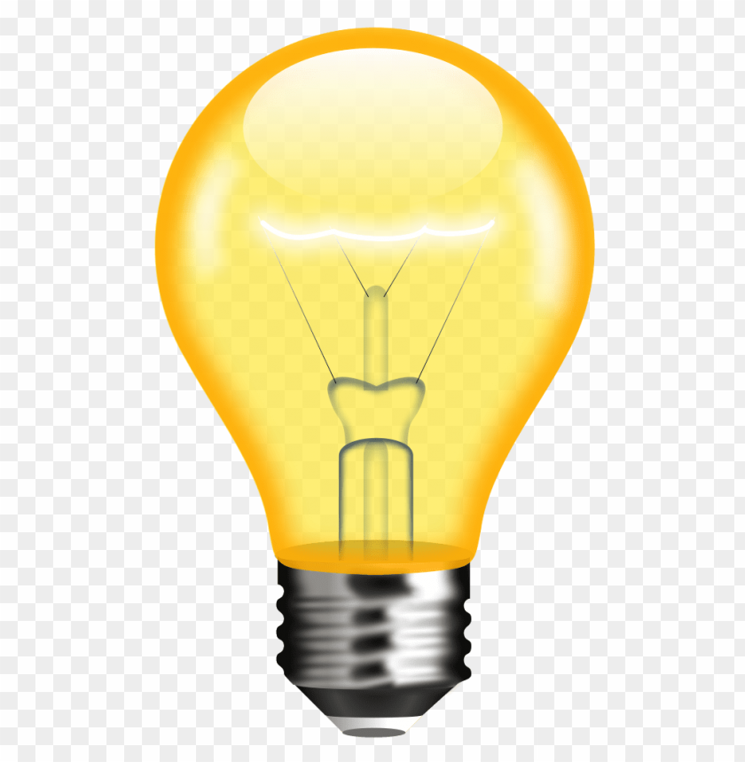

# Light Bulb Toggle Web Project

## Description
This is a simple responsive web project that simulates a light bulb turning ON and OFF with a toggle button below the bulb image. The background color changes dynamically based on the bulb’s state. The project also includes a fixed footer that remains at the bottom of the page.

## Features
- Responsive layout that works well on mobile, tablet, and desktop devices.
- Animated toggle button positioned under the light bulb image.
- Dynamic background color changes:
  - Green when the bulb is ON
  - Red when the bulb is OFF
- Fixed footer with centered credit text.

## Technologies Used
- HTML5
- CSS3 (Flexbox, animations)
- JavaScript (DOM manipulation)

## Screenshots
  

## Author
Made by Chandra Sekhar

